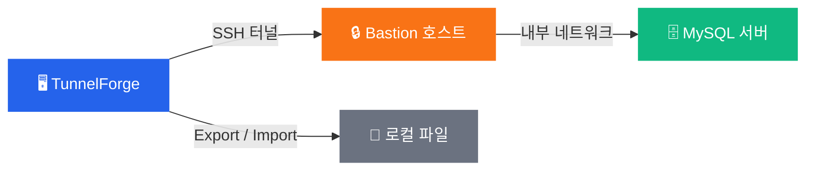

# TunnelForge

**SSH 터널을 통한 안전한 데이터베이스 관리 — CLI 없이 간편하게.**

[한국어](README.ko.md) · [English](README.md)

---

## 주요 기능

| | 기능 | 설명 |
|:-:|------|------|
| 🔐 | **SSH 터널** | 원클릭으로 Bastion 호스트를 통한 보안 연결. RSA, Ed25519, ECDSA 키 지원. |
| 🔗 | **직접 연결** | 터널 없이 로컬 또는 접근 가능한 DB에 바로 연결. |
| ⚡ | **병렬 Export/Import** | MySQL Shell의 병렬 처리로 초고속 데이터 전송. |
| 📅 | **[스케줄 백업](SCHEDULE.md)** | Cron 스타일 자동 백업으로 데이터를 안전하게 보관. |
| 🖥️ | **시스템 트레이** | 백그라운드에서 조용히 실행, 필요할 때 바로 사용. |
| 🔄 | **자동 업데이트 확인** | 시작 시 새 버전을 확인하여 항상 최신 상태 유지. |

---

## 다운로드

[-2563EB?style=for-the-badge)](https://github.com/sanghyun-io/tunnelforge/releases/latest/download/TunnelForge-WebSetup.exe)
&nbsp;&nbsp;
[-6B7280?style=for-the-badge)](https://github.com/sanghyun-io/tunnelforge/releases/latest/download/TunnelForge-Setup-latest.exe)

[모든 릴리스 보기 →](https://github.com/sanghyun-io/tunnelforge/releases)

---

## 빠른 시작

### 1. 설치

다운로드한 설치 파일을 실행하고 설치 마법사를 따라 진행하세요.

### 2. 터널 추가

**"터널 추가"** 버튼을 클릭하고 연결 정보를 설정하세요:

| 항목 | 설명 | 예시 |
|------|------|------|
| 터널 이름 | 구분하기 쉬운 이름 | `운영 DB` |
| Bastion 호스트 | SSH 점프 서버 주소 | `bastion.example.com` |
| SSH 키 | 개인 키 파일 경로 | `C:\Users\me\.ssh\id_rsa` |
| DB 호스트 | 대상 DB 서버 (Bastion 기준) | `db.internal:3306` |
| DB 인증 정보 | 사용자명 & 비밀번호 | `admin` / `••••` |

### 3. 연결 & 사용

터널 선택 → **"연결"** 클릭 → 데이터베이스 도구 사용:
- **Export** — 스키마 또는 선택한 테이블 백업
- **Import** — 백업 파일에서 복원

---

## 동작 원리

---

## 사용 팁

<b>여러 환경 관리</b>

각 환경(개발, 스테이징, 운영)별로 명확한 이름의 터널 설정을 만들어 체계적으로 관리하세요.

<b>Export 모범 사례</b>

- 구조 백업에는 **스키마 전용 Export** 사용
- 필요한 것만 내보내려면 **테이블 선택** 사용
- Export는 병렬로 실행되어 빠르게 완료

<b>시스템 트레이 활용</b>

- 트레이로 최소화하면 터널이 백그라운드에서 계속 실행
- 트레이 아이콘 더블클릭으로 창 복원
- 우클릭으로 빠른 동작 메뉴

---

## 요구 사항

| 요구 사항 | 비고 |
|----------|------|
| **Windows 10+** | 기본 지원 플랫폼 |
| **[MySQL Shell](https://dev.mysql.com/downloads/shell/)** | Export/Import 기능 사용 시 필요 |

## 설정 파일 위치

`%LOCALAPPDATA%\TunnelForge\config.json`

---

**[기여하기](CONTRIBUTING.md)** · **[라이선스 (MIT)](LICENSE)**

보안을 중시하는 데이터베이스 엔지니어를 위해 만들었습니다. ❤️

