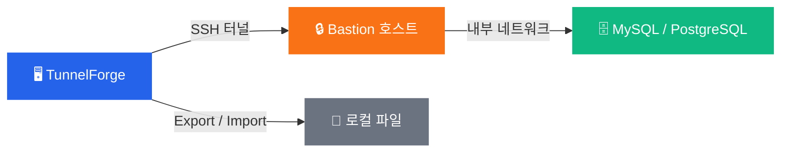

# TunnelForge

**SSH 터널을 통한 안전한 데이터베이스 관리 — CLI 없이 간편하게.**

[한국어](README.ko.md) · [English](README.md)

---

## 주요 기능

### 연결 & 터널 관리

| | 기능 | 설명 |
|:-:|------|------|
| 🔐 | **SSH 터널** | 원클릭으로 Bastion 호스트를 통한 보안 연결. RSA, Ed25519, ECDSA 키 지원. |
| 🔗 | **직접 연결** | 터널 없이 로컬 또는 접근 가능한 MySQL/PostgreSQL DB에 바로 연결. |
| 📁 | **터널 그룹** | 터널을 색상별 그룹으로 정리하고, 드래그 앤 드롭으로 순서 변경 및 그룹 단위 일괄 연결/해제. |
| 📡 | **터널 모니터링** | 실시간 상태 확인과 자동 재연결, 연결 지속 시간·최근 이벤트를 보여주는 상세 뷰. |
| 🖥️ | **시스템 트레이** | 백그라운드에서 조용히 실행, 필요할 때 바로 사용. |

### SQL 에디터

| | 기능 | 설명 |
|:-:|------|------|
| 📝 | **구문 강조 & 검증** | 입력하는 동안 실시간 SQL 강조와 흔한 실수에 대한 인라인 경고 표시. |
| ✨ | **자동완성** | 스키마·테이블·컬럼 문맥을 인식하는 자동완성 제안. |
| 🔁 | **트랜잭션 모드** | 수동 커밋/롤백과 미커밋 변경사항 목록 추적. |
| ✏️ | **셀 직접 편집** | 조회 결과 그리드에서 바로 값 수정 — Primary Key 기준으로 안전하게 해당 행만 반영. |
| 🕘 | **쿼리 히스토리** | 과거 실행한 쿼리를 다시 보고 재실행. |
| 🛡️ | **프로덕션 가드** | 운영 DB 대상 위험한 작업 실행 전 확인 프롬프트. |

### 스키마 관리

| | 기능 | 설명 |
|:-:|------|------|
| 🔍 | **스키마 Diff** | 두 데이터베이스 간 스키마를 시각적으로 나란히 비교. |
| 🔄 | **스키마 동기화** | 환경 간 스키마를 맞추는 동기화 스크립트 생성 및 실행. |
| 🎨 | **픽셀 아트 로딩** | 스키마 비교 중 재미있는 픽셀 아트 DB 애니메이션. |

### 마이그레이션 도구

| | 기능 | 설명 |
|:-:|------|------|
| 🚀 | **원클릭 마이그레이션** | Rust DB Core 기반, dry-run 우선의 단일 흐름으로 진행하는 MySQL 8.0 → 8.4 업그레이드. |
| 🛡️ | **업그레이드 호환성 분석** | Deprecated 함수, 예약어 충돌, 문자셋 이슈, 고아 레코드 등 MySQL 8.4 업그레이드 위험을 상세 점검. |
| 🧙 | **가이드 수정 위저드** | 단계별로 제안된 수정 사항을 검토하고 적용하는 위저드. 실행 전 dry-run 미리보기 제공. |
| 🔄 | **DB 전환** | Rust DB Core 기반 MySQL ↔ PostgreSQL 전환 워크플로우. |
| 📊 | **마이그레이션 보고서** | 호환성 점검 결과를 HTML/JSON 보고서로 내보내기. |

### 데이터 도구

| | 기능 | 설명 |
|:-:|------|------|
| ⚡ | **병렬 Export/Import** | Rust DB Core의 병렬 처리로 초고속 스키마/데이터 전송. |
| 🧩 | **고아 레코드 분석** | 깨진 외래키 관계로 남은 고아 레코드를 탐지하고 보고서로 내보내기. |
| ⏰ | **예약 백업 & 쿼리 실행** | Cron 기반으로 반복 Export/SQL 작업을 자동화. |

### 일반

| | 기능 | 설명 |
|:-:|------|------|
| 🌐 | **다국어 UI** | 설정에서 앱 언어를 한국어/영어로 전환. |
| 🌓 | **라이트 / 다크 테마** | 환경에 맞는 테마 선택. |
| 🔄 | **자동 업데이트 확인** | 시작 시 새 버전을 확인하여 항상 최신 상태 유지. |
| 🐛 | **선택적 이슈 리포터** | 명시적으로 설정 시 GitHub App 기반 오류 보고. |

---

## 다운로드

[-2563EB?style=for-the-badge)](https://github.com/sanghyun-io/tunnelforge/releases/latest/download/TunnelForge-WebSetup.exe)
&nbsp;&nbsp;
[-6B7280?style=for-the-badge)](https://github.com/sanghyun-io/tunnelforge/releases/latest)

[macOS DMG/ZIP과 버전별 오프라인 설치 파일은 모든 릴리스에서 받기 →](https://github.com/sanghyun-io/tunnelforge/releases)

macOS DMG/ZIP 설치파일은 최종 실제 Mac 운영자 검증 전의 베타 배포물입니다. SSH, DB, migration, LaunchAgent, Gatekeeper 흐름에서 이슈가 있을 수 있으며 운영 환경 사용은 사용자 책임이고, 최종 검증 전 동작을 보증하지 않습니다.

---

## 빠른 시작

### 1. 설치

다운로드한 설치 파일을 실행하고 설치 마법사를 따라 진행하세요. macOS에서는 Mac 아키텍처에 맞는 DMG(`arm64`는 Apple Silicon, `x86_64`는 Intel)를 받고, 필요하면 함께 제공되는 `.sha256` 파일로 검증한 뒤, DMG를 열어 `TunnelForge.app`을 Applications로 이동하세요.

### 2. 터널 추가

**"터널 추가"** 버튼을 클릭하고 연결 정보를 설정하세요:

| 항목 | 설명 | 예시 |
|------|------|------|
| 터널 이름 | 구분하기 쉬운 이름 | `운영 DB` |
| Bastion 호스트 | SSH 점프 서버 주소 | `bastion.example.com` |
| SSH 키 | 개인 키 파일 경로 | `C:\Users\me\.ssh\id_rsa` |
| DB 호스트 | 대상 DB 서버 (Bastion 기준) | `db.internal:3306` |
| DB 인증 정보 | 사용자명 & 비밀번호 | `admin` / `••••` |

### 3. 연결 & 사용

터널 선택 → **"연결"** 클릭 → 데이터베이스 도구 사용:
- **SQL 에디터** — 쿼리 실행, 결과 확인, 커밋 또는 롤백
- **Export** — 스키마 또는 선택한 테이블 백업
- **Import** — 백업 파일에서 복원
- 터널 우클릭으로 **스키마 Diff**, **마이그레이션 분석**, **고아 레코드 분석** 실행

---

## 동작 원리

```mermaid
graph LR
    A["🖥️ TunnelForge"] -->|SSH 터널| B["🔒 Bastion 호스트"]
    B -->|내부 네트워크| C["🗄️ MySQL / PostgreSQL"]
    A -->|"Export / Import"| D["📁 로컬 파일"]

    style A fill:#2563EB,color:#fff,stroke:none
    style B fill:#F97316,color:#fff,stroke:none
    style C fill:#10B981,color:#fff,stroke:none
    style D fill:#6B7280,color:#fff,stroke:none
```

---

## 사용 팁

<b>여러 환경 관리</b>

각 환경(개발, 스테이징, 운영)별로 명확한 이름의 터널 설정을 만들고, 색상별 **터널 그룹**으로 묶어 일괄 연결/해제를 활용하세요.

<b>Export 모범 사례</b>

- 구조 백업에는 **스키마 전용 Export** 사용
- 필요한 것만 내보내려면 **테이블 선택** 사용
- Export는 병렬로 실행되어 빠르게 완료
- 반복적으로 수행하는 Export는 **예약 백업**으로 자동화

<b>SQL 에디터 안전하게 쓰기</b>

- **트랜잭션 모드**를 켜두면 커밋 전에 변경사항을 미리 검토할 수 있음
- 운영 터널 대상 위험한 구문은 **프로덕션 가드**가 확인을 요청
- 셀 직접 편집은 Primary Key 기준으로 범위가 제한되어, 수정한 행만 반영됨

<b>시스템 트레이 활용</b>

- 트레이로 최소화하면 터널이 백그라운드에서 계속 실행
- 트레이 아이콘 더블클릭으로 창 복원
- 우클릭으로 빠른 동작 메뉴

---

## 요구 사항

| 요구 사항 | 비고 |
|----------|------|
| **Windows 10+** | 패키징 지원 플랫폼 |
| **macOS 13+** | 앱 번들 빌드 지원, 릴리스별 실제 기기 검증 필요 |
| **Rust DB Core 바이너리** | Export/Import, 마이그레이션, SQL 실행 기능용으로 TunnelForge에 빌드/패키징됨 |

macOS 지원 범위와 최종 검증 체크리스트는 [macOS Support Plan](docs/macos_support.md)을 참고하세요.

## 설정 파일 위치

- Windows: `%LOCALAPPDATA%\TunnelForge\config.json`
- macOS: `~/Library/Application Support/TunnelForge/config.json`

---

**[기여하기](CONTRIBUTING.md)** · **[라이선스 (MIT)](LICENSE)**

보안을 중시하는 데이터베이스 엔지니어를 위해 만들었습니다. ❤️

