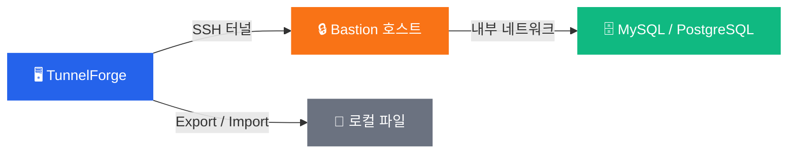

# TunnelForge

**Bastion 호스트를 거쳐 MySQL/PostgreSQL에 접속하는 사람을 위한 데스크톱 앱: SSH 터널, SQL 에디터, 검증되는 백업/복원, MySQL ↔ PostgreSQL 전환을 한 창에서.**

[한국어](README.ko.md) · [English](README.md)

Bastion 뒤에 있는 DB를 열고, 테이블·컬럼 자동완성으로 SQL을 작성해 결과까지 한 창에서 확인합니다.

- **기본은 안전 복원** — Import는 새 네임스페이스에 복원하고 검증을 마친 뒤에야 반영됩니다. 덮어쓰기는 검증 후에만 원래 이름으로 교체하고, 기존 데이터는 백업으로 남깁니다.
- **확인할 수 있는 MySQL ↔ PostgreSQL 전환** — 사전 점검, 계획, 청크 단위 복사, 이어하기, 그리고 원본 키 기준으로 모든 행을 비교하는 검증(키가 없는 테이블은 digest로 비교).
- **DB 작업은 Rust 코어가 담당** — 인증, 스키마, SQL, 덤프/Import, 전환은 `tunnelforge-core`에서 실행되고, Python/PyQt6는 UI를 맡습니다.
- **실제 DB로 도는 CI 게이트** — PR 필수 체크가 실제 MySQL·PostgreSQL 컨테이너로 덤프/Import, 안전 복원, 엔진 간 전환 테스트를 실행합니다.

**다운로드:** [최신 릴리스](https://github.com/sanghyun-io/tunnelforge/releases/latest) · [Windows 설치 (웹, ~12MB)](https://github.com/sanghyun-io/tunnelforge/releases/latest/download/TunnelForge-WebSetup.exe) · [macOS DMG (베타)](https://github.com/sanghyun-io/tunnelforge/releases/latest)

> Windows 빌드는 아직 코드 서명이 되어 있지 않아 첫 실행 시 SmartScreen 경고가 뜰 수 있습니다. **추가 정보 → 실행**을 누르세요. macOS 빌드는 베타입니다(CI에서 검증, 실제 Mac 검증은 아직). [코드 서명 정책](#code-signing-policy) 참고.

질문·아이디어: [Discussions](https://github.com/sanghyun-io/tunnelforge/discussions) · 기여하고 싶다면: [good first issue](https://github.com/sanghyun-io/tunnelforge/labels/good%20first%20issue) · [기여하기](CONTRIBUTING.md)

---

## 주요 기능

### 연결 & 터널 관리

| | 기능 | 설명 |
|:-:|------|------|
| 🔐 | **SSH 터널** | 원클릭으로 Bastion 호스트를 통한 보안 연결. RSA, Ed25519, ECDSA 키 지원. |
| 🔗 | **직접 연결** | 터널 없이 로컬 또는 접근 가능한 MySQL/PostgreSQL DB에 바로 연결. |
| 📁 | **터널 그룹** | 터널을 색상별 그룹으로 정리하고, 드래그 앤 드롭으로 순서 변경 및 그룹 단위 일괄 연결/해제. 드래그 앤 드롭, 우클릭 메뉴의 **그룹으로 이동**(기존 그룹, 그룹에서 제거, 새 그룹), 추가/편집 창의 **그룹** 항목으로 연결을 그룹에 넣을 수 있음. 연결 설정 창은 작은 화면에서 스크롤되며 버튼은 항상 보임. |
| 🔒 | **검증된 TLS & SSH 신뢰** | DB TLS는 `verify_full`(새 프로필 기본값), `verify_ca`, `disable` 중 선택하고 CA 파일을 추가로 지정 가능. SSH 호스트 키는 처음 접속할 때 지문을 확인한 뒤 신뢰하며, 암호화된 SSH 키도 지원. [연결 신뢰 정책](docs/connection_trust_policy.md) |
| 📡 | **터널 모니터링** | 실시간 상태 확인과 자동 재연결, 연결 지속 시간·최근 이벤트를 보여주는 상세 뷰. |
| 🖥️ | **시스템 트레이** | 백그라운드에서 조용히 실행, 필요할 때 바로 사용. |

### SQL 에디터

| | 기능 | 설명 |
|:-:|------|------|
| 📝 | **구문 강조 & 검증** | 입력하는 동안 실시간 SQL 강조와 흔한 실수에 대한 인라인 경고 표시. |
| ✨ | **자동완성** | 스키마·테이블·컬럼 문맥을 인식하는 자동완성 제안. |
| 🔁 | **트랜잭션 모드** | 수동 커밋/롤백과 미커밋 변경사항 목록 추적. |
| ✏️ | **셀 직접 편집** | 조회 결과 그리드에서 바로 값 수정 — Primary Key 기준으로 안전하게 해당 행만 반영. |
| 🕘 | **쿼리 히스토리** | 과거 실행한 쿼리를 다시 보고 재실행. |
| 🛡️ | **프로덕션 가드** | 운영 프로필의 SQL 세션은 기본적으로 읽기 전용으로 열림. 스키마 이름을 입력해 창별로 잠금을 해제하고, 커밋 전에 변경 요약을 확인. Export/Import/마이그레이션의 확인 프롬프트는 그대로 유지. [운영 읽기 전용 세션](docs/production_read_only.md) |
| ⏹️ | **쿼리 취소 & 타임아웃** | 실행 중인 쿼리를 서버 측에서 취소하거나 시간 제한을 걸고, 결과에 행 수·바이트 한도 적용. |
| 🌊 | **스트리밍 결과 그리드** | 쿼리가 실행되는 동안 결과가 그리드에 순차적으로 표시됨. |
| 💾 | **결과 저장** | 표시된 행 또는 전체 결과를 CSV나 JSON Lines로 저장. [결과 저장 안내](docs/query_results_export.md) |
| 🧭 | **실행 계획 보기** | 툴바나 Ctrl+E로 실행 계획 확인. EXPLAIN ANALYZE는 롤백되는 읽기 전용 트랜잭션 안에서 실행. [실행 계획 보기](docs/explain_plan.md) |
| ♻️ | **작업 공간 복구** | 재시작이나 비정상 종료 후 SQL 에디터 탭과 내용을 복구. |

### 스키마 관리

| | 기능 | 설명 |
|:-:|------|------|
| 🔍 | **스키마 Diff** | 두 데이터베이스 간 스키마를 시각적으로 나란히 비교. |
| 🔄 | **스키마 동기화** | 환경 간 스키마를 맞추는 동기화 스크립트 생성 및 실행. |
| 🎨 | **픽셀 아트 로딩** | 스키마 비교 중 재미있는 픽셀 아트 DB 애니메이션. |

### 마이그레이션 도구

| | 기능 | 설명 |
|:-:|------|------|
| 🚀 | **원클릭 마이그레이션** | Rust DB Core 기반, dry-run 우선의 단일 흐름으로 진행하는 MySQL 8.0 → 8.4 업그레이드. |
| 🛡️ | **업그레이드 호환성 분석** | Deprecated 함수, 예약어 충돌, 문자셋 이슈, 고아 레코드 등 MySQL 8.4 업그레이드 위험을 상세 점검. |
| 🧙 | **가이드 수정 위저드** | 제안된 수정 사항을 단계별로 미리 보고 검토용 수동 SQL을 생성하는 위저드입니다. 자동 적용은 하지 않습니다. |
| 🔄 | **DB 전환** | Rust DB Core 기반 MySQL ↔ PostgreSQL 전환 워크플로우. 타입을 보존하는 매핑(숫자 범위/정밀도, UNSIGNED 확장, FLOAT/DOUBLE, UUID, BIT, 배열은 텍스트로, TIMESTAMPTZ는 UTC로), 청크 단위 복사, 이어서 하기, 어느 엔진의 정렬 규칙(collation)에도 의존하지 않는 전체 행 검증 제공. 상대 엔진에 저장할 수 없는 값(MySQL의 0 날짜와 24:00을 넘는 TIME, PostgreSQL의 infinity·기원전 날짜·9999년 이후 연도·timetz)과 MySQL 공간/PostGIS 컬럼은 복사 도중 실패하지 않도록 사전 점검에서 거부. |
| 📊 | **마이그레이션 보고서** | 호환성 점검 결과를 HTML/JSON 보고서로 내보내기. |

### 데이터 도구

| | 기능 | 설명 |
|:-:|------|------|
| ⚡ | **Export/Import** | 데이터 검증, 엔진별 스냅샷 정책, MySQL 병렬 처리와 명확한 복원 제약을 제공하는 테이블 전송. Import 방식: **안전 복원**(기본값: 새 네임스페이스에 복원하고 검증을 마친 뒤에야 기존 데이터를 변경), **덮어쓰기**(안전 복원 후 원래 이름으로 자동 교체, 기존 데이터는 백업으로 보관), **전체 교체**(고급 옵션, mysqldump처럼 테이블별로 처리, 기존 데이터 삭제). [Export/Import 정책 및 제약](docs/export_import_policy.md) |
| 🧩 | **고아 레코드 분석** | 깨진 외래키 관계로 남은 고아 레코드를 탐지하고 보고서로 내보내기. |
| 📋 | **작업 목록** | Export, Import, 교체, 마이그레이션 실행 기록을 영구 보관하고 필터, 보고서, 실패 사유 확인. [작업 목록 안내](docs/job_list.md) |
| 🗄️ | **백업 수명 주기** | 백업 목록 조회와 상태 대조, 검증을 거친 정리, 안내에 따른 롤백. |

예약 백업을 사용할 수 있습니다 (백업만: DST 인지 시각 계산, 절전 후 최대 1회 따라잡기, SSH 호스트 키를 자동 수락하지 않는 무인 실행, 소유 확인 후 보존 정리, 비운영 프로필로의 복원 리허설(선택), PostgreSQL 데이터베이스 선택). 예약 SQL 실행은 지원하지 않습니다. 자세한 내용은 [SCHEDULE.md](SCHEDULE.md)를 참조하세요.

### 일반

| | 기능 | 설명 |
|:-:|------|------|
| 🌐 | **다국어 UI** | 설정에서 앱 언어를 한국어/영어로 전환. |
| 🌓 | **라이트 / 다크 테마** | 환경에 맞는 테마 선택. |
| 🔄 | **자동 업데이트 확인** | 시작 시 새 버전을 확인하여 항상 최신 상태 유지. |
| 🛡️ | **익명 오류 보고** | 명시적 동의 후 엄격한 허용 목록의 보고서만 릴레이로 전송하며, 클라이언트 GitHub 자격 증명이 필요하지 않습니다. [오류 보고 안내](docs/error_reporting.md) |

---

## 스크린샷

| 연결 목록과 그룹 | SQL 에디터 |
|:-:|:-:|
|  |  |
| 환경별로 묶인 터널과 실시간 상태(연결됨, 재연결 중). | 스키마 트리, 구문 강조, 검증, 결과, 트랜잭션 제어. |

| 연결 설정 | 안전한 Import 방식 | MySQL ↔ PostgreSQL |
|:-:|:-:|:-:|
|  |  |  |
| Bastion 경유 SSH 터널, TLS 검증, 자격 증명 저장. | 기본은 안전 복원, 덮어쓰기는 검증을 마친 뒤에만 교체. | 사전 점검과 검증이 포함된 단계별 전환. |

스크린샷은 데모 데이터입니다.

---

## 다운로드

[-2563EB?style=for-the-badge)](https://github.com/sanghyun-io/tunnelforge/releases/latest/download/TunnelForge-WebSetup.exe)
&nbsp;&nbsp;
[-6B7280?style=for-the-badge)](https://github.com/sanghyun-io/tunnelforge/releases/latest)

[macOS DMG/ZIP과 버전별 오프라인 설치 파일은 모든 릴리스에서 받기 →](https://github.com/sanghyun-io/tunnelforge/releases)

macOS DMG/ZIP 설치파일은 최종 실제 Mac 운영자 검증 전의 베타 배포물입니다. SSH, DB, migration, LaunchAgent, Gatekeeper 흐름에서 이슈가 있을 수 있으며 운영 환경 사용은 사용자 책임이고, 최종 검증 전 동작을 보증하지 않습니다.

[Code signing policy (코드 서명 정책)](#code-signing-policy)

---

## 빠른 시작

### 1. 설치

다운로드한 설치 파일을 실행하고 설치 마법사를 따라 진행하세요. macOS에서는 Mac 아키텍처에 맞는 DMG(`arm64`는 Apple Silicon, `x86_64`는 Intel)를 받고, 필요하면 함께 제공되는 `.sha256` 파일로 검증한 뒤, DMG를 열어 `TunnelForge.app`을 Applications로 이동하세요.

### 2. 터널 추가

**"터널 추가"** 버튼을 클릭하고 연결 정보를 설정하세요:

| 항목 | 설명 | 예시 |
|------|------|------|
| 터널 이름 | 구분하기 쉬운 이름 | `운영 DB` |
| Bastion 호스트 | SSH 점프 서버 주소 | `bastion.example.com` |
| SSH 키 | 개인 키 파일 경로 | `C:\Users\me\.ssh\id_rsa` |
| DB 호스트 | 대상 DB 서버 (Bastion 기준) | `db.internal:3306` |
| DB 인증 정보 | 사용자명 & 비밀번호 | `admin` / `••••` |
| DB TLS | `verify_full`(기본값), `verify_ca`, `disable` 중 선택, CA 파일 지정 가능 | `verify_full` |

### 3. 연결 & 사용

터널 선택 → **"연결"** 클릭 → 데이터베이스 도구 사용:
- **SQL 에디터** — 쿼리 실행, 결과 확인, 커밋 또는 롤백
- **Export** — 스키마 또는 선택한 테이블 백업
- **Import** — 백업 파일에서 **안전 복원**(기본값), **덮어쓰기**, **전체 교체**(고급 옵션, 기존 데이터 삭제) 방식으로 복원. [Export/Import 정책 및 제약](docs/export_import_policy.md) 참조
- 터널 우클릭으로 **스키마 Diff**, **마이그레이션 분석**, **고아 레코드 분석** 실행

---

## 동작 원리

```mermaid
graph LR
    A["🖥️ TunnelForge"] -->|SSH 터널| B["🔒 Bastion 호스트"]
    B -->|내부 네트워크| C["🗄️ MySQL / PostgreSQL"]
    A -->|"Export / Import"| D["📁 로컬 파일"]

    style A fill:#2563EB,color:#fff,stroke:none
    style B fill:#F97316,color:#fff,stroke:none
    style C fill:#10B981,color:#fff,stroke:none
    style D fill:#6B7280,color:#fff,stroke:none
```

---

## 사용 팁

<b>여러 환경 관리</b>

각 환경(개발, 스테이징, 운영)별로 명확한 이름의 터널 설정을 만들고, 색상별 **터널 그룹**으로 묶어 일괄 연결/해제를 활용하세요.

<b>Export 모범 사례</b>

- 복원 전에 [Export/Import 정책 및 제약](docs/export_import_policy.md) 확인
- 필요한 것만 내보내려면 **테이블 선택** 사용
- MySQL 공유 스냅샷은 병렬 처리, 권한 대체 경로와 PostgreSQL은 단일 일관 세션 사용
- 덤프는 manifest v3(**TunnelForge 2.6.0 이상**)으로 기록되며, MySQL BIT 컬럼이 있으면 v4(**2.12.2 이상**), MySQL 공간 컬럼(GEOMETRY, POINT 등)이 있으면 v5(**2.12.4 이상**)로 기록됨. 기존 v1/v2 덤프는 계속 읽을 수 있음
- 다음 이전 백업은 **다시 Export** 필요: 2.12.1 이전에 만든 BINARY/VARBINARY/BYTEA 키·MySQL ENUM 키·백슬래시가 들어간 복합 키를 가진 테이블의 백업, 2.12.2 이전에 만든 MySQL BIT 컬럼 백업, 2.12.4 이전에 만든 MySQL 공간 컬럼 백업(이전 공간 덤프는 Import 시 다시 Export하라는 메시지와 함께 거부됨)

<b>SQL 에디터 안전하게 쓰기</b>

- **트랜잭션 모드**를 켜두면 커밋 전에 변경사항을 미리 검토할 수 있음
- 운영 터널의 SQL 에디터는 읽기 전용으로 열리며, 스키마 이름을 입력해 창별로 잠금을 해제할 수 있고 커밋 전에는 **프로덕션 가드**가 변경 요약을 보여줌
- 셀 직접 편집은 Primary Key 기준으로 범위가 제한되어, 수정한 행만 반영됨

<b>시스템 트레이 활용</b>

- 트레이로 최소화하면 터널이 백그라운드에서 계속 실행
- 트레이 아이콘 더블클릭으로 창 복원
- 우클릭으로 빠른 동작 메뉴

---

## 요구 사항

| 요구 사항 | 비고 |
|----------|------|
| **Windows 10+** | 패키징 지원 플랫폼 |
| **macOS 13+** | 앱 번들 빌드 지원, 릴리스별 실제 기기 검증 필요 |
| **Rust DB Core 바이너리** | Export/Import, 마이그레이션, SQL 실행 기능용으로 TunnelForge에 빌드/패키징됨 |

macOS 지원 범위와 최종 검증 체크리스트는 [macOS Support Plan](docs/macos_support.md)을 참고하세요.

## 설정 파일 위치

- Windows: `%LOCALAPPDATA%\TunnelForge\config.json`
- macOS: `~/Library/Application Support/TunnelForge/config.json`

## Code signing policy

**현황:** 릴리스 바이너리는 현재 **서명되지 않았습니다**. SignPath Foundation 오픈소스 프로그램은 이번에는 이 프로젝트를 승인하지 않았습니다(2026년 10월). 릴리스 워크플로에는 서명 단계가 이미 들어 있으며, 추후 승인되면 서명을 켭니다. macOS DMG/ZIP 빌드는 계속 서명되지 않은 베타 배포물입니다.

서명이 켜지면, 서명 대상은 이 저장소의 GitHub Actions 릴리스 워크플로가 빌드한 Windows 바이너리뿐입니다: `TunnelForge.exe`, `tunnelforge-core.exe`, `TunnelForge-WebSetup.exe`, `TunnelForge-Setup-<version>.exe`.

**팀 역할**

- Committers / Reviewers: [sanghyun-io](https://github.com/sanghyun-io)
- Approvers: [sanghyun-io](https://github.com/sanghyun-io)

**개인정보 처리 방침 (Privacy policy)**

TunnelForge는 개인정보를 수집하지 않으며 사용 통계(텔레메트리)도 없습니다. 네트워크 연결은 다음뿐입니다.

- 사용자가 설정한 SSH 서버와 데이터베이스
- 새 버전 확인을 위한 공개 GitHub Releases API(`api.github.com`) 조회 — **기본으로 켜져 있어 앱 시작 시 실행**되며, 요청 외의 데이터는 보내지 않고 설정(자동 업데이트 확인)에서 끌 수 있음
- 메인테이너가 운영하는 오류 보고 중계 서버(Cloudflare Workers)를 거쳐 GitHub 이슈로 등록되는 익명 오류 보고 — 사용자가 동의한 **경우에만** 전송 ([오류 보고 안내](docs/error_reporting.md))

---

**[기여하기](CONTRIBUTING.md)** · **[라이선스 (MIT)](LICENSE)**

보안을 중시하는 데이터베이스 엔지니어를 위해 만들었습니다. ❤️

