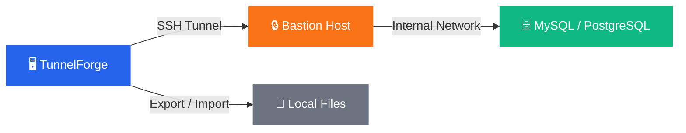

# TunnelForge

**Secure database management through SSH tunnels — no CLI required.**

[한국어](README.ko.md) · [English](README.md)

---

## Features

### Connection & Tunnel Management

| | Feature | Description |
|:-:|---------|-------------|
| 🔐 | **SSH Tunnel** | One-click secure connection via bastion hosts. RSA, Ed25519, ECDSA keys supported. |
| 🔗 | **Direct Connect** | Skip the tunnel — connect directly to local or accessible MySQL/PostgreSQL databases. |
| 📁 | **Tunnel Groups** | Organize tunnels into color-coded groups with drag-and-drop reordering and bulk connect/disconnect. |
| 📡 | **Tunnel Monitoring** | Real-time health checks with auto-reconnect, plus a detail view of connection duration and recent events. |
| 🖥️ | **System Tray** | Runs quietly in the background, always one click away. |

### SQL Editor

| | Feature | Description |
|:-:|---------|-------------|
| 📝 | **Syntax Highlighting & Validation** | Live SQL highlighting with inline warnings for common mistakes as you type. |
| ✨ | **Autocomplete** | Context-aware suggestions for schemas, tables, and columns. |
| 🔁 | **Transaction Mode** | Manual commit/rollback with a running list of pending, uncommitted changes. |
| ✏️ | **Inline Cell Editing** | Edit query results directly in the grid — updates are scoped safely by primary key. |
| 🕘 | **Query History** | Revisit and re-run past queries. |
| 🛡️ | **Production Guard** | Confirmation prompts before risky operations against production databases. |

### Schema Management

| | Feature | Description |
|:-:|---------|-------------|
| 🔍 | **Schema Diff** | Visual side-by-side schema comparison between any two databases. |
| 🔄 | **Schema Sync** | Generate and execute sync scripts to align schemas across environments. |
| 🎨 | **Pixel Art Loading** | Fun pixel-art DB animation while comparing schemas. |

### Migration Tools

| | Feature | Description |
|:-:|---------|-------------|
| 🚀 | **One-Click Migration** | Guided, dry-run-first MySQL 8.0 → 8.4 upgrade in a single flow, powered by Rust DB Core. |
| 🛡️ | **Upgrade Compatibility Analysis** | Detailed checks surface MySQL 8.4 upgrade risks — deprecated functions, reserved words, charset issues, orphaned records, and more. |
| 🧙 | **Guided Fix Wizard** | Step-by-step wizard that previews fixes and generates manual SQL for review; it does not apply changes automatically. |
| 🔄 | **Cross-Engine Migration** | Guided MySQL ↔ PostgreSQL migration powered by Rust DB Core. |
| 📊 | **Migration Report** | Export detailed HTML/JSON reports of compatibility findings. |

### Data Tools

| | Feature | Description |
|:-:|---------|-------------|
| ⚡ | **Parallel Export/Import** | Blazing-fast schema and data transfers powered by Rust DB Core's parallel processing. |
| 🧩 | **Orphan Record Analysis** | Detect rows left behind by broken foreign-key relationships and export the findings as a report. |

Scheduled Backups & Queries are disabled in the default UI and cannot be used pending intentional reactivation and verification. See [SCHEDULE.md](SCHEDULE.md) for the current status.

### General

| | Feature | Description |
|:-:|---------|-------------|
| 🌐 | **Bilingual UI** | Switch the app's language between Korean and English from Settings. |
| 🌓 | **Light / Dark Theme** | Pick the theme that suits your setup. |
| 🔄 | **Auto Update** | Checks for new versions on startup so you never miss an update. |
| 🐛 | **Optional Issue Reporter** | GitHub App-based error reporting when explicitly configured. |

---

## Download

[-2563EB?style=for-the-badge)](https://github.com/sanghyun-io/tunnelforge/releases/latest/download/TunnelForge-WebSetup.exe)
&nbsp;&nbsp;
[-6B7280?style=for-the-badge)](https://github.com/sanghyun-io/tunnelforge/releases/latest)

[Browse all releases for macOS DMG/ZIP and the versioned offline installer →](https://github.com/sanghyun-io/tunnelforge/releases)

macOS DMG/ZIP packages are beta artifacts pending final real-Mac operator validation. They may have issues in SSH, DB, migration, LaunchAgent, or Gatekeeper flows; use them at your own risk and without warranty until final validation is complete.

---

## Quick Start

### 1. Install

Run the downloaded installer and follow the setup wizard. On macOS, download the DMG for your Mac architecture (`arm64` for Apple Silicon, `x86_64` for Intel), optionally verify it with the matching `.sha256` file, open it, and move `TunnelForge.app` to Applications.

### 2. Add a Tunnel

Click **"Add Tunnel"** and configure your connection:

| Field | Description | Example |
|-------|-------------|---------|
| Tunnel Name | A friendly label | `Production DB` |
| Bastion Host | SSH jump server | `bastion.example.com` |
| SSH Key | Private key file path | `C:\Users\me\.ssh\id_rsa` |
| DB Host | Target database (from bastion's perspective) | `db.internal:3306` |
| DB Credentials | Username & password | `admin` / `••••` |

### 3. Connect & Go

Select a tunnel → Click **"Connect"** → Use the database tools:
- **SQL Editor** — Run queries, review results, commit or roll back changes
- **Export** — Backup schemas or selected tables
- **Import** — Restore from backup files
- Right-click a tunnel for **Schema Diff**, **Migration Analysis**, and **Orphan Record Analysis**

---

## How It Works

```mermaid
graph LR
    A["🖥️ TunnelForge"] -->|SSH Tunnel| B["🔒 Bastion Host"]
    B -->|Internal Network| C["🗄️ MySQL / PostgreSQL"]
    A -->|"Export / Import"| D["📁 Local Files"]

    style A fill:#2563EB,color:#fff,stroke:none
    style B fill:#F97316,color:#fff,stroke:none
    style C fill:#10B981,color:#fff,stroke:none
    style D fill:#6B7280,color:#fff,stroke:none
```

---

## Tips

<b>Managing Multiple Environments</b>

Create separate tunnel configs for each environment (Dev, Staging, Production) with clear naming, then organize them into color-coded **Tunnel Groups** for quick bulk connect/disconnect.

<b>Export Best Practices</b>

- Use **schema-only export** for structure backups
- Use **table selection** to export only what you need
- Exports run in parallel for faster completion

<b>SQL Editor Safety</b>

- Leave **Transaction Mode** on to review pending changes before committing
- **Production Guard** will prompt for confirmation on risky statements against production tunnels
- Inline cell edits are scoped by primary key, so only the row you touched is updated

<b>System Tray Usage</b>

- Minimize to tray to keep tunnels alive in the background
- Double-click the tray icon to restore the window
- Right-click for quick-action menu

---

## Requirements

| Requirement | Note |
|-------------|------|
| **Windows 10+** | Supported packaged platform |
| **macOS 13+** | Supported as a packaged app build; final device validation is required per release |
| **Rust DB Core binary** | Built and packaged with TunnelForge for Export/Import, Migration, and SQL execution features |

For the macOS support scope and final validation checklist, see [macOS Support Plan](docs/macos_support.md).

## Configuration

Settings are stored at:

- Windows: `%LOCALAPPDATA%\TunnelForge\config.json`
- macOS: `~/Library/Application Support/TunnelForge/config.json`

---

**[Contributing](CONTRIBUTING.md)** · **[License (MIT)](LICENSE)**

Made with ❤️ for database engineers who value security.

