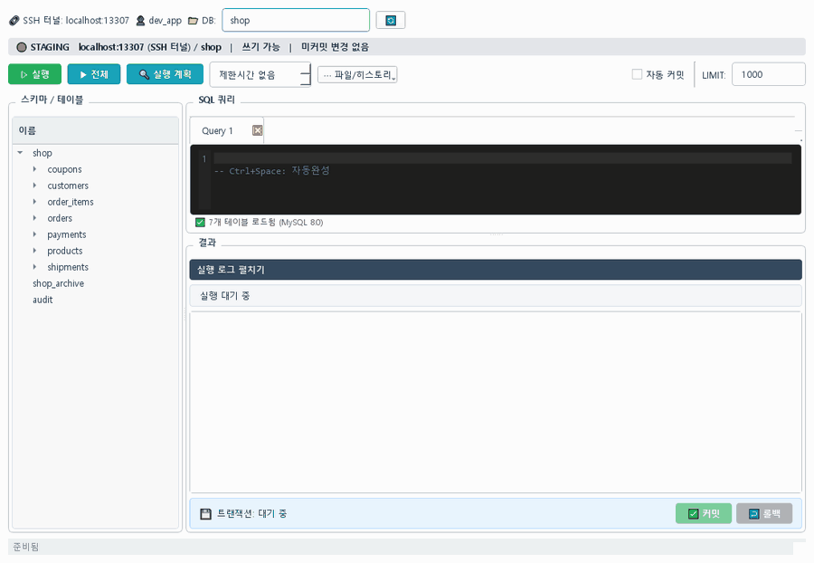
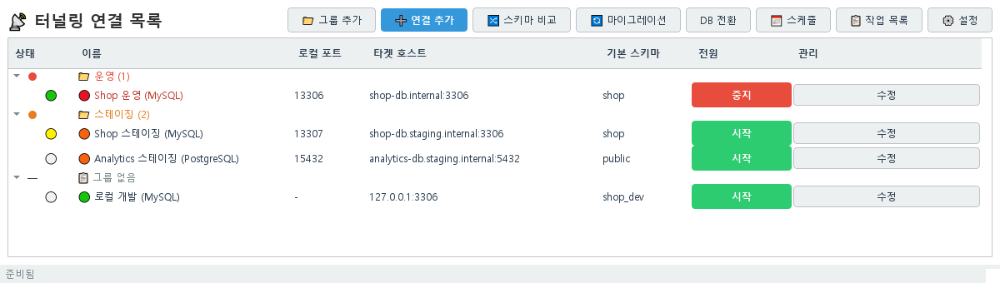
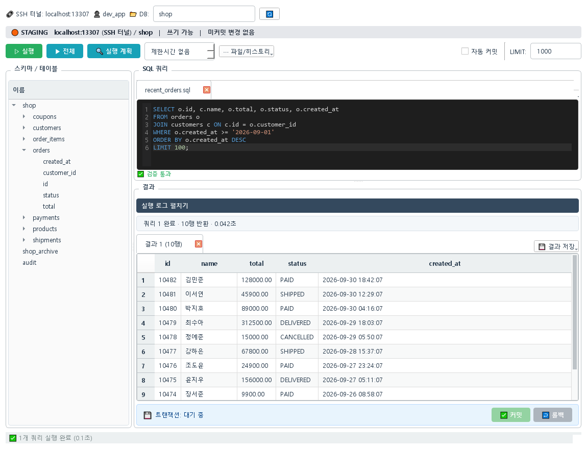
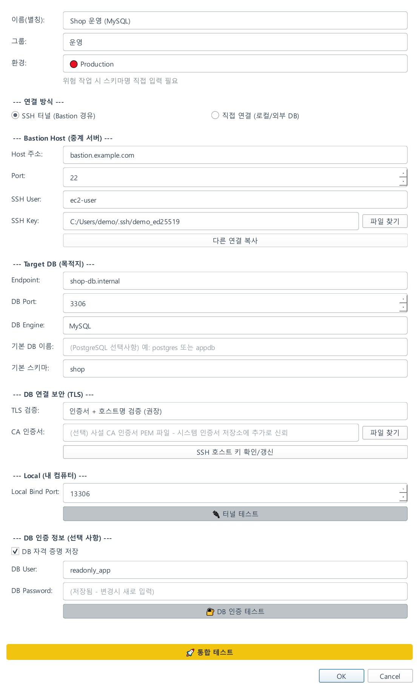
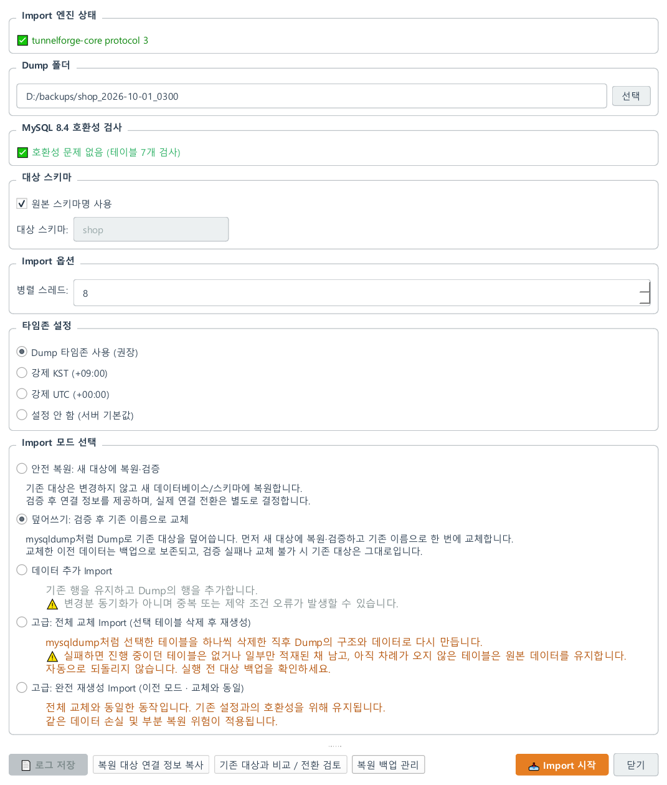
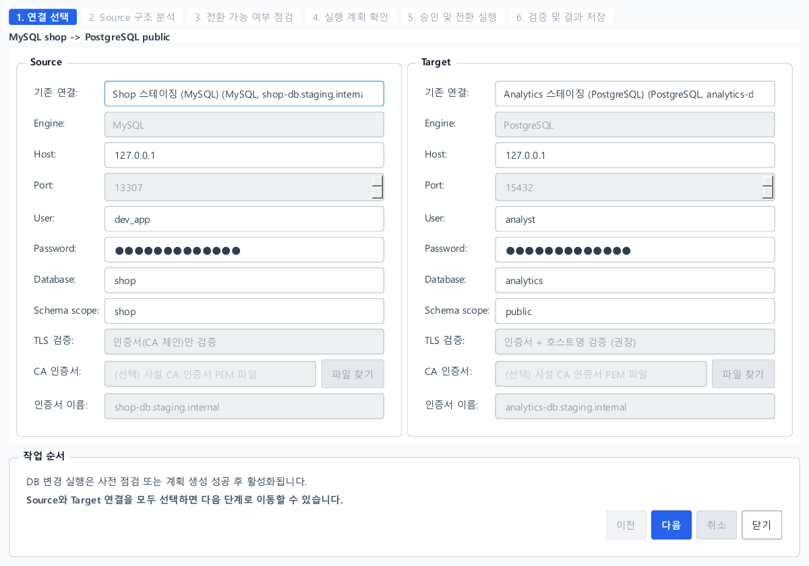
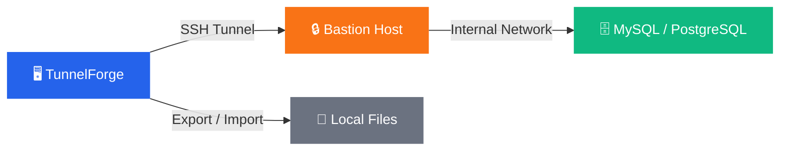

# TunnelForge

**Secure database management through SSH tunnels — no CLI required.**

[한국어](README.ko.md) · [English](README.md)

Open a database behind a bastion host, write SQL with table and column autocomplete, and see results — all in one window.

---

## Features

### Connection & Tunnel Management

| | Feature | Description |
|:-:|---------|-------------|
| 🔐 | **SSH Tunnel** | One-click secure connection via bastion hosts. RSA, Ed25519, ECDSA keys supported. |
| 🔗 | **Direct Connect** | Skip the tunnel — connect directly to local or accessible MySQL/PostgreSQL databases. |
| 📁 | **Tunnel Groups** | Organize tunnels into color-coded groups with drag-and-drop reordering and bulk connect/disconnect. Move a connection into a group by drag and drop, by the right-click **Move to Group** menu (existing group, remove from group, new group), or with the **Group** field in the add/edit dialog. The connection dialog scrolls on small screens and keeps its buttons visible. |
| 🔒 | **Verified TLS & SSH Trust** | DB TLS with `verify_full` (default for new profiles), `verify_ca`, or `disable`, plus an optional CA file; SSH host keys are trusted on first use after you confirm the fingerprint; encrypted SSH keys supported. See [connection trust policy](docs/connection_trust_policy.md). |
| 📡 | **Tunnel Monitoring** | Real-time health checks with auto-reconnect, plus a detail view of connection duration and recent events. |
| 🖥️ | **System Tray** | Runs quietly in the background, always one click away. |

### SQL Editor

| | Feature | Description |
|:-:|---------|-------------|
| 📝 | **Syntax Highlighting & Validation** | Live SQL highlighting with inline warnings for common mistakes as you type. |
| ✨ | **Autocomplete** | Context-aware suggestions for schemas, tables, and columns. |
| 🔁 | **Transaction Mode** | Manual commit/rollback with a running list of pending, uncommitted changes. |
| ✏️ | **Inline Cell Editing** | Edit query results directly in the grid — updates are scoped safely by primary key. |
| 🕘 | **Query History** | Revisit and re-run past queries. |
| 🛡️ | **Production Guard** | Production profiles open SQL sessions read-only by default; unlock a window by typing the schema name, and review a change summary before commit. Export/Import/migration keep their confirmation prompts. See [production read-only sessions](docs/production_read_only.md). |
| ⏹️ | **Query Cancel & Timeout** | Server-side cancel and timeout for running queries, with row and byte limits on results. |
| 🌊 | **Streaming Result Grid** | Results stream into the grid while the query is still running. |
| 💾 | **Save Results** | Save results to CSV or JSON Lines — the shown rows or the full result. See [saving results](docs/query_results_export.md). |
| 🧭 | **Execution Plan View** | Open the plan from the toolbar or with Ctrl+E; EXPLAIN ANALYZE runs in a read-only transaction that is rolled back. See [execution plan view](docs/explain_plan.md). |
| ♻️ | **Workspace Recovery** | SQL editor tabs and text are restored after a restart or crash. |

### Schema Management

| | Feature | Description |
|:-:|---------|-------------|
| 🔍 | **Schema Diff** | Visual side-by-side schema comparison between any two databases. |
| 🔄 | **Schema Sync** | Generate and execute sync scripts to align schemas across environments. |
| 🎨 | **Pixel Art Loading** | Fun pixel-art DB animation while comparing schemas. |

### Migration Tools

| | Feature | Description |
|:-:|---------|-------------|
| 🚀 | **One-Click Migration** | Guided, dry-run-first MySQL 8.0 → 8.4 upgrade in a single flow, powered by Rust DB Core. |
| 🛡️ | **Upgrade Compatibility Analysis** | Detailed checks surface MySQL 8.4 upgrade risks — deprecated functions, reserved words, charset issues, orphaned records, and more. |
| 🧙 | **Guided Fix Wizard** | Step-by-step wizard that previews fixes and generates manual SQL for review; it does not apply changes automatically. |
| 🔄 | **Cross-Engine Migration** | Guided MySQL ↔ PostgreSQL migration powered by Rust DB Core. Type-preserving mapping (numeric range/precision, UNSIGNED widening, FLOAT/DOUBLE, UUID, BIT, arrays as text, TIMESTAMPTZ in UTC), chunked copy, resume, and full row verification that does not depend on either engine's collation order. Values the other engine cannot store (MySQL zero dates and TIME beyond 24:00; PostgreSQL infinity, BC dates, years after 9999, timetz) and MySQL spatial/PostGIS columns are refused at the pre-check instead of failing mid-copy. |
| 📊 | **Migration Report** | Export detailed HTML/JSON reports of compatibility findings. |

### Data Tools

| | Feature | Description |
|:-:|---------|-------------|
| ⚡ | **Export/Import** | Validated table transfers with engine-specific snapshot policies, parallel MySQL paths, and explicit restore constraints. Import modes: **Safe restore** (default: restores into a new namespace and verifies before anything changes), **Overwrite** (safe restore, then an automatic swap under the original name; the old data is kept as a backup), and **Replace** (advanced; table by table like mysqldump; destructive). See the [Export/Import contract](docs/export_import_policy.md). |
| 🧩 | **Orphan Record Analysis** | Detect rows left behind by broken foreign-key relationships and export the findings as a report. |
| 📋 | **Job List** | Export, Import, promotion and migration runs with persistent run history, filters, reports and failure reasons. See [job list](docs/job_list.md). |
| 🗄️ | **Backup Lifecycle** | List and reconcile backups, clean them up only after verification, and roll back with a guided flow. |

Scheduled backups are available (backup tasks only: DST-aware times, at most one catch-up after sleep, unattended runs that never auto-accept SSH host keys, ownership-checked retention, optional restore rehearsal into a non-production profile, and PostgreSQL database selection). Scheduled SQL execution is not supported. See [SCHEDULE.md](SCHEDULE.md).

### General

| | Feature | Description |
|:-:|---------|-------------|
| 🌐 | **Bilingual UI** | Switch the app's language between Korean and English from Settings. |
| 🌓 | **Light / Dark Theme** | Pick the theme that suits your setup. |
| 🔄 | **Auto Update** | Checks for new versions on startup so you never miss an update. |
| 🛡️ | **Anonymous Error Reporting** | Explicit opt-in sends a strict allowlisted report through a relay; no client GitHub credential is required. See [error reporting](docs/error_reporting.md). |

---

## Screenshots

| Connections & groups | SQL editor |
|:-:|:-:|
|  |  |
| Tunnels grouped by environment with live status (connected, reconnecting). | Schema tree, highlighting, validation, results and transaction controls. |

| Connection settings | Safe import modes | MySQL ↔ PostgreSQL |
|:-:|:-:|:-:|
|  |  |  |
| SSH tunnel through a bastion, verified TLS, saved credentials. | Safe restore by default; overwrite swaps only after verification. | Step-by-step migration with pre-checks and verification. |

Screenshots use demo data.

---

## Download

[-2563EB?style=for-the-badge)](https://github.com/sanghyun-io/tunnelforge/releases/latest/download/TunnelForge-WebSetup.exe)
&nbsp;&nbsp;
[-6B7280?style=for-the-badge)](https://github.com/sanghyun-io/tunnelforge/releases/latest)

[Browse all releases for macOS DMG/ZIP and the versioned offline installer →](https://github.com/sanghyun-io/tunnelforge/releases)

macOS DMG/ZIP packages are beta artifacts pending final real-Mac operator validation. They may have issues in SSH, DB, migration, LaunchAgent, or Gatekeeper flows; use them at your own risk and without warranty until final validation is complete.

---

## Quick Start

### 1. Install

Run the downloaded installer and follow the setup wizard. On macOS, download the DMG for your Mac architecture (`arm64` for Apple Silicon, `x86_64` for Intel), optionally verify it with the matching `.sha256` file, open it, and move `TunnelForge.app` to Applications.

### 2. Add a Tunnel

Click **"Add Tunnel"** and configure your connection:

| Field | Description | Example |
|-------|-------------|---------|
| Tunnel Name | A friendly label | `Production DB` |
| Bastion Host | SSH jump server | `bastion.example.com` |
| SSH Key | Private key file path | `C:\Users\me\.ssh\id_rsa` |
| DB Host | Target database (from bastion's perspective) | `db.internal:3306` |
| DB Credentials | Username & password | `admin` / `••••` |
| DB TLS | `verify_full` (default), `verify_ca`, or `disable`; optional CA file | `verify_full` |

### 3. Connect & Go

Select a tunnel → Click **"Connect"** → Use the database tools:
- **SQL Editor** — Run queries, review results, commit or roll back changes
- **Export** — Backup schemas or selected tables
- **Import** — Restore from backup files with **Safe restore** (default), **Overwrite**, or **Replace** (advanced, destructive); see the [Export/Import contract](docs/export_import_policy.md)
- Right-click a tunnel for **Schema Diff**, **Migration Analysis**, and **Orphan Record Analysis**

---

## How It Works

```mermaid
graph LR
    A["🖥️ TunnelForge"] -->|SSH Tunnel| B["🔒 Bastion Host"]
    B -->|Internal Network| C["🗄️ MySQL / PostgreSQL"]
    A -->|"Export / Import"| D["📁 Local Files"]

    style A fill:#2563EB,color:#fff,stroke:none
    style B fill:#F97316,color:#fff,stroke:none
    style C fill:#10B981,color:#fff,stroke:none
    style D fill:#6B7280,color:#fff,stroke:none
```

---

## Tips

<b>Managing Multiple Environments</b>

Create separate tunnel configs for each environment (Dev, Staging, Production) with clear naming, then organize them into color-coded **Tunnel Groups** for quick bulk connect/disconnect.

<b>Export Best Practices</b>

- Review the [Export/Import contract](docs/export_import_policy.md) before restoring a backup
- Use **table selection** to export only what you need
- MySQL shared-snapshot export supports parallel workers; privilege fallback and PostgreSQL use one consistent session
- Dumps use manifest v3 (**TunnelForge 2.6.0+**); dumps with MySQL BIT columns are v4 (**2.12.2+**); dumps with MySQL spatial columns (GEOMETRY, POINT, ...) are v5 (**2.12.4+**); existing v1/v2 dumps remain readable
- **Re-export** these older backups: backups taken before 2.12.1 of tables keyed by BINARY/VARBINARY/BYTEA, MySQL ENUM keys, or composite keys containing a backslash; backups with MySQL BIT columns taken before 2.12.2; backups with MySQL spatial columns taken before 2.12.4 (older spatial dumps are refused on import with a re-export message)

<b>SQL Editor Safety</b>

- Leave **Transaction Mode** on to review pending changes before committing
- Production tunnels open the SQL editor read-only; type the schema name to unlock a window, and **Production Guard** shows a change summary before commit
- Inline cell edits are scoped by primary key, so only the row you touched is updated

<b>System Tray Usage</b>

- Minimize to tray to keep tunnels alive in the background
- Double-click the tray icon to restore the window
- Right-click for quick-action menu

---

## Requirements

| Requirement | Note |
|-------------|------|
| **Windows 10+** | Supported packaged platform |
| **macOS 13+** | Supported as a packaged app build; final device validation is required per release |
| **Rust DB Core binary** | Built and packaged with TunnelForge for Export/Import, Migration, and SQL execution features |

For the macOS support scope and final validation checklist, see [macOS Support Plan](docs/macos_support.md).

## Configuration

Settings are stored at:

- Windows: `%LOCALAPPDATA%\TunnelForge\config.json`
- macOS: `~/Library/Application Support/TunnelForge/config.json`

---

**[Contributing](CONTRIBUTING.md)** · **[License (MIT)](LICENSE)**

Made with ❤️ for database engineers who value security.

