# TunnelForge

**Secure database management through SSH tunnels — no CLI required.**

[한국어](README.ko.md) · [English](README.md)

---

## Features

| | Feature | Description |
|:-:|---------|-------------|
| 🔐 | **SSH Tunnel** | One-click secure connection via bastion hosts. RSA, Ed25519, ECDSA keys supported. |
| 🔗 | **Direct Connect** | Skip the tunnel — connect directly to local or accessible databases. |
| ⚡ | **Parallel Export/Import** | Blazing-fast data transfers powered by MySQL Shell's parallel processing. |
| 📅 | **[Scheduled Backup](SCHEDULE.md)** | Cron-style automated backups to keep your data safe. |
| 🖥️ | **System Tray** | Runs quietly in the background, always one click away. |
| 🔄 | **Auto Update** | Checks for new versions on startup so you never miss an update. |

---

## Download

[-2563EB?style=for-the-badge)](https://github.com/sanghyun-io/tunnelforge/releases/latest/download/TunnelForge-WebSetup.exe)
&nbsp;&nbsp;
[-6B7280?style=for-the-badge)](https://github.com/sanghyun-io/tunnelforge/releases/latest/download/TunnelForge-Setup-latest.exe)

[Browse all releases →](https://github.com/sanghyun-io/tunnelforge/releases)

---

## Quick Start

### 1. Install

Run the downloaded installer and follow the setup wizard.

### 2. Add a Tunnel

Click **"Add Tunnel"** and configure your connection:

| Field | Description | Example |
|-------|-------------|---------|
| Tunnel Name | A friendly label | `Production DB` |
| Bastion Host | SSH jump server | `bastion.example.com` |
| SSH Key | Private key file path | `C:\Users\me\.ssh\id_rsa` |
| DB Host | Target database (from bastion's perspective) | `db.internal:3306` |
| DB Credentials | Username & password | `admin` / `••••` |

### 3. Connect & Go

Select a tunnel → Click **"Connect"** → Use the database tools:
- **Export** — Backup schemas or selected tables
- **Import** — Restore from backup files

---

## How It Works

```mermaid
graph LR
    A["🖥️ TunnelForge"] -->|SSH Tunnel| B["🔒 Bastion Host"]
    B -->|Internal Network| C["🗄️ MySQL Server"]
    A -->|"Export / Import"| D["📁 Local Files"]

    style A fill:#2563EB,color:#fff,stroke:none
    style B fill:#F97316,color:#fff,stroke:none
    style C fill:#10B981,color:#fff,stroke:none
    style D fill:#6B7280,color:#fff,stroke:none
```

---

## Tips

<b>Managing Multiple Environments</b>

Create separate tunnel configs for each environment (Dev, Staging, Production) with clear naming — keep things organized.

<b>Export Best Practices</b>

- Use **schema-only export** for structure backups
- Use **table selection** to export only what you need
- Exports run in parallel for faster completion

<b>System Tray Usage</b>

- Minimize to tray to keep tunnels alive in the background
- Double-click the tray icon to restore the window
- Right-click for quick-action menu

---

## Requirements

| Requirement | Note |
|-------------|------|
| **Windows 10+** | Primary supported platform |
| **[MySQL Shell](https://dev.mysql.com/downloads/shell/)** | Required for Export/Import features |

## Configuration

Settings are stored at: `%LOCALAPPDATA%\TunnelForge\config.json`

---

**[Contributing](CONTRIBUTING.md)** · **[License (MIT)](LICENSE)**

Made with ❤️ for database engineers who value security.

